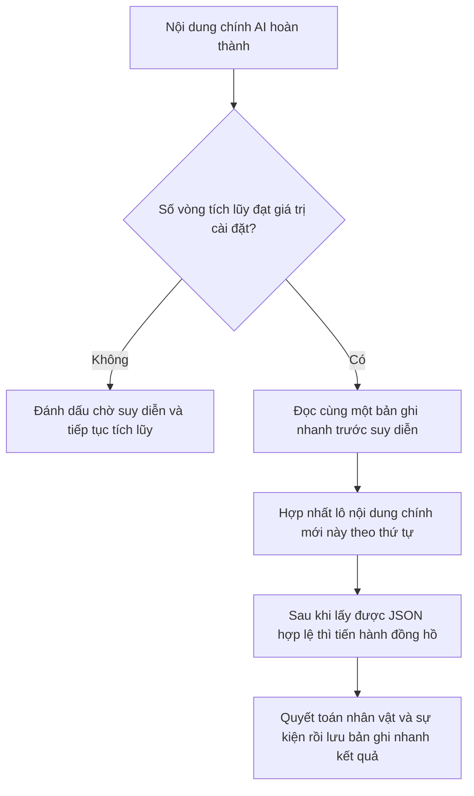
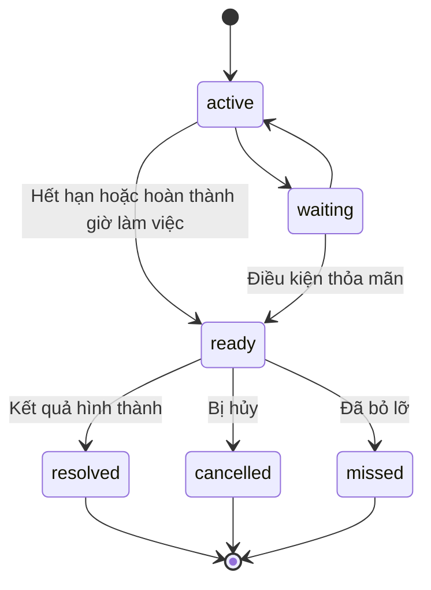

# Mặt trái thế giới 0.8.1 Hướng dẫn kiến trúc

## 0.8.1 Nội dung chính liên tục và gửi nối tiếp

- Suy diễn thế giới vẫn sử dụng chuỗi nối tiếp đơn, nhưng mục xếp hàng được nâng cấp thành mô tả nhiệm vụ không thể thay đổi, cố định trò chuyện, tầng tin nhắn, swipe, hash nội dung chính, nguyên nhân kích hoạt và ứng viên hiển thị vòng này. Nhiệm vụ cùng nguồn chỉ giữ lại một bản.
- Nội dung chính AI mới đến khi nhiệm vụ hiện tại đang chạy chỉ ghi thẻ `pending`, không tạo trước `base`; khi thực sự đến lượt nội dung chính đó mới dẫn xuất từ bản ghi nhanh đã gửi trước đó, tránh bản ghi nhanh cũ ghi đè lên thay đổi thế giới đã hoàn thành trước.
- Trước khi thực thi sẽ kiểm tra lại định danh trò chuyện, swipe và hash nội dung chính; khi chuyển đổi trò chuyện hoặc sửa đổi nhánh trong quá trình thực thi, kết quả trả về sẽ không được ghi vào trang hiện tại, ngoại lệ và hủy bỏ cũng sẽ không thay đổi store của cuộc trò chuyện khác.
- API độc lập không bao giờ xóa chèn nội dung chính của Tavern; yêu cầu im lặng gốc của Tavern chỉ tạm thời cách ly chèn của chính nó trong khoảnh khắc tạo yêu cầu, sau đó khôi phục ngay lập tức, không chờ mô hình chạy ngầm trả về.
- Khi nhiệm vụ hiện tại thất bại, chỉ khi thực sự tồn tại nội dung chính muộn hơn mới thử hợp nhất để bắt kịp; người dùng chủ động hủy sẽ không tự động khởi động lại nhiệm vụ đã bị hủy.
- Lớp trích xuất tự sự có thể chọn lọc thẻ: `filterNarrativeText` khi suy diễn / ký ức / quan sát nhân vật đọc nội dung chính sẽ loại bỏ chú thích HTML và thẻ đóng mở do người dùng cấu hình; hash nhánh và đánh giá tính khả dụng vẫn sử dụng văn bản gốc.

## 0.8.0 Điểm khôi phục và chẩn đoán bảo mật quyền riêng tư

- store chính của mỗi cuộc trò chuyện giữ tối đa 3 điểm khôi phục. Điểm khôi phục chỉ lưu `currentState` chuẩn tại thời điểm đó, không sao chép cấu hình API, nội dung chính hoặc toàn bộ bản ghi nhanh nhánh, tránh phóng to vô hạn metadata của cuộc trò chuyện.
- `getStore()` tạo một điểm khôi phục trước khi nâng cấp lần đầu `schemaVersion` cũ; trạng thái nhập tạo điểm khôi phục sau khi xác nhận thay thế, trước khi thực sự ghi vào. Bản thân thao tác khôi phục cũng lưu trạng thái hiện tại trước.
- Sau khi khôi phục sẽ ghi trạng thái mục tiêu vào `branchOverrides` của điểm neo nội dung chính hiện tại, do đó chỉ ảnh hưởng đến cuộc trò chuyện hiện tại và nhánh hiện tại, sẽ không xuyên qua các swipe khác.
- Báo cáo chẩn đoán chỉ tổng hợp phiên bản plugin/cấu trúc dữ liệu, khung nhìn thiết bị, chế độ giao diện, công tắc chức năng, số lượng trạng thái và lỗi nhiệm vụ gần đây; Key, URL, nội dung chính, điểm neo thân phận và từ nhắc tùy chỉnh không đưa vào báo cáo. Lỗi gần đây chỉ ghi lại các danh mục như `invalid-json`, `output-limit`, `network`, không sao chép đoạn trả về của mô hình.
- `notify` trong plugin là lối ra bình thường duy nhất của nhắc nhở trạng thái, hiển thị tiêu đề và biểu tượng cảm xúc theo tone; toastr của SillyTavern chỉ làm phương án dự phòng khi giao diện chưa được khởi tạo.

## 0.7.0 Giao dịch có thể hủy, điểm neo nhân vật và cầu nối Worldbook

- Mỗi lần suy diễn thế giới giữ một `AbortController` độc lập. Hủy bỏ chỉ chấm dứt yêu cầu hiện tại, JSON hợp lệ trước khi áp dụng sẽ kiểm tra lại tín hiệu hủy; nhánh hủy bỏ giữ lại `pending`, sẽ không vào `applySimulationResult`.
- `personalityAnchor`, `speakingStyle` và `behaviorBoundaries` là các ràng buộc nhân vật ổn định do người dùng duy trì. Chúng đi vào prompt suy diễn và quan sát nhân vật, nhưng giá trị đã có sẽ không bị ghi đè bởi `people_upsert` thông thường.
- Cầu nối Worldbook gọi `getWorldInfoNames()` và `loadWorldInfo()` được công khai bởi ngữ cảnh mở rộng của Tavern; kết quả đọc chỉ đặt trong bản xem trước khi chạy, sau khi người dùng chọn mới chuyển thành thẻ nhân vật thủ công của cuộc trò chuyện này.
- Nhập Worldbook sẽ không vào chuỗi điều độ tự động. Nhân vật nhập vẫn tham gia suy diễn tiếp theo thông qua cùng ngân sách NPC chạy ngầm và ranh giới kiến thức.

## 0.5.5 Khung nhìn di động và lớp cài đặt

- Bố cục di động đồng thời sử dụng đơn vị khung nhìn động, `safe-area` của hệ thống và độ lệch `VisualViewport`; không phân nhánh theo thương hiệu hoặc kiểu điện thoại, màn hình ngang dọc và thay đổi khu vực khả dụng thống nhất đi theo cùng một bộ tính toán ranh giới.
- Bảng cài đặt điện thoại sau khi kết xuất được nâng lên thành phần tử con trực tiếp của nút gốc, thoát khỏi `overflow` của cửa sổ chính và containing block của hoạt ảnh; khi xoay về bố cục máy tính để bàn sẽ đặt lại vị trí cũ vào cửa sổ.
- Lớp nổi gốc sử dụng cấp độ cao nhất mà trình duyệt có thể chấp nhận và giữ cho khu vực trống có thể xuyên qua, tránh nút lơ lửng của bên thứ ba che khuất bảng điều khiển, đồng thời không chặn thao tác trang Tavern khi đóng plugin.
- Kích thước quả cầu lơ lửng được tính toán từ cạnh ngắn của khu vực hiển thị hiện tại, phạm vi điện thoại là 36—42px; tọa độ đã lưu, kéo hút cạnh và vị trí sau khi xoay đều sẽ được kẹp lại theo `VisualViewport`.

## 0.5.4 Khôi phục JSON giao diện tương thích

- Giao diện độc lập sẽ đọc `finish_reason` trong phản hồi tương thích OpenAI; các nguyên nhân như `length`, `MAX_TOKENS` sẽ được nhận diện là đầu ra bị cắt bớt, thay vì báo cáo chung chung là JSON không hợp lệ.
- Tự động thử lại của suy diễn thế giới và sắp xếp lịch sử tăng hạn mức đầu ra theo số lần thử, mỗi lần tăng 1800 token, tối đa 16000, và giảm nhiệt độ; prompt thử lại yêu cầu bỏ qua các tùy chọn không thay đổi và đóng hoàn chỉnh đối tượng.
- Trích xuất JSON chỉ thực hiện sửa chữa cú pháp mang tính xác định: loại bỏ dấu phẩy ở cuối đối tượng/mảng, và các ký tự điều khiển trần trong chuỗi thoát. Kết quả bị cắt bớt thiếu dấu ngoặc đóng sẽ không được đoán bổ sung hoặc ghi vào trạng thái.

## 0.5.3 Hiển thị tiếng lòng

- `innerVoiceAt` tiếp tục được giữ lại trong trạng thái nhân vật và bản ghi nhanh nhánh, nhưng `renderInnerVoice` chỉ xuất nội dung chính độc thoại, không kết xuất lặp lại thời điểm tạo thành tiêu đề thẻ.
- Dữ liệu thời gian và trình bày trực quan được tách rời, không thay đổi di chuyển kết quả suy diễn, khôi phục rút lại, ranh giới kiến thức hoặc cấu trúc prompt.

## 0.5.2 Tính ổn định khi chuyển đổi mô-đun

- `panelEntrancePending` chỉ được đặt khi bảng điều khiển chính chuyển từ đóng sang mở; vẽ lại toàn bộ cây DOM do cài đặt, trạng thái và chuyển đổi mô-đun gây ra sẽ không nhận lại `is-opening`.
- Khung hình chính vào sân của bảng điều khiển và mặt nạ chỉ liên kết với `.wb-panel-scrim.is-opening`, không còn liên kết với lớp cơ sở được xây dựng lại mỗi lần.
- Nội dung mô-đun vẫn có thể dùng dịch chuyển 2px để nhắc nhở trang có thay đổi, nhưng khung hình chính không thay đổi độ trong suốt, do đó nội dung chính SillyTavern ở lớp dưới sẽ không lộ ra trong khoảnh khắc chuyển đổi.

## 0.5.1 Lớp trải nghiệm

- Trang ký ức sử dụng bộ lọc, từ khóa và số mục hiển thị mỗi loại cục bộ của giao diện, không thay đổi sổ cái ký ức ở lớp dưới; mặc định mỗi loại chỉ tạo 12 thẻ, sau khi người dùng chủ động nhấp mới tiếp tục mở rộng DOM.
- Trạng thái mở rộng của nhóm cài đặt, lọc ký ức, từ tìm kiếm và số mục hiển thị chỉ tồn tại trong vòng đời trang hiện tại, không ghi vào metadata của cuộc trò chuyện, cũng không làm ô nhiễm nhánh rút lại.
- `getSyncStatus` tổng hợp trạng thái suy diễn thế giới, trạng thái sắp xếp ký ức, số lượng nội dung chính AI chưa sắp xếp và trạng thái hoàn tác ngắn hạn; giao diện chọn nhiệm vụ hoạt động liên quan nhất để hiển thị.
- Hoàn tác thao tác thủ công lưu một lần trạng thái trước đó và điểm neo trò chuyện/nhánh lúc đó, trong vòng chín giây và điểm neo không thay đổi mới có thể khôi phục; kết quả suy diễn tự động không vào ngăn xếp hoàn tác này.
- Hoạt ảnh đóng bảng điều khiển chỉ trì hoãn gỡ cài đặt 145ms, không trì hoãn lưu trạng thái thế giới; khi hệ thống bật "giảm hoạt ảnh", CSS sẽ nén thời lượng hoạt ảnh xuống gần bằng không.

## 0.5 Liên kết mới thêm

- Thời gian chuẩn vẫn sử dụng tính toán phút tuyệt đối, `world.calendar` lưu thêm tên lịch và điểm neo ngày tháng; giao diện và prompt thống nhất thông qua `formatWorldCalendar` ánh xạ thành năm, tháng, ngày, giờ, phút.
- `storyMemory.digest` là tóm tắt liên tục được viết lại không ngừng, `storyMemory.facts` là sự thật dài hạn kèm quan hệ phiên bản, `storyMemory.summaries` là trải nghiệm giai đoạn, `storyMemory.clues` là phục bút chờ hô ứng hoặc thu hồi.
- Tự động sắp xếp ký ức đếm theo số lượng nội dung chính AI chưa lưu trữ, không thay thế bằng số tin nhắn người dùng hoặc tổng số tầng. Sau khi đạt N mục do người dùng cài đặt, chỉ sắp xếp khoảng mới thêm.
- Khi khóa sự thật tương tự xuất hiện giá trị mới sẽ giữ lại phiên bản cũ; giá trị mới được xác định sẽ thay thế giá trị cũ, giá trị mới chưa được xác nhận sẽ khiến các cách nói cạnh tranh song song đi vào trạng thái tranh chấp, phủ định rõ ràng thì đi vào trạng thái vô hiệu.
- Suy diễn thế giới và sắp xếp lịch sử đều có thể ghi vào sự thật dài hạn và phục bút; truy xuất tính liên quan tổng hợp thẻ thực thể, đoạn nhị phân tiếng Trung/văn bản, mức độ quan trọng, độ tin cậy và suy giảm khoảng cách tin nhắn.
- Chèn nội dung chính là lối ra an toàn riêng biệt, chỉ cho phép sự thật và manh mối liên quan `known` hoặc `direct` đi qua; tóm tắt liên tục, trải nghiệm giai đoạn, nội dung `hidden`/`trace` không trực tiếp chèn vào nội dung chính.
- Quả cầu lơ lửng chuyển đổi tên lớp chạy dựa trên trạng thái suy diễn thế giới và trạng thái sắp xếp ký ức, hoạt ảnh trực quan không tham gia vào bất kỳ tính toán trạng thái nào.

## 0.4 Liên kết mới thêm

- `api.js` chịu trách nhiệm cho giao diện tương thích OpenAI độc lập. Chế độ `proxy` chỉ mượn backend cùng nguồn của SillyTavern để chuyển tiếp yêu cầu mạng, URL, Key, mô hình và nội dung tin nhắn đều đến từ cài đặt plugin; chế độ `direct` trực tiếp yêu cầu upstream. DeepSeek V4 sẽ tắt suy nghĩ không cần thiết, và trong chế độ proxy sử dụng kênh tương thích DeepSeek của Tavern.
- `storyMemory.summaries` lưu tóm tắt lịch sử theo lô, `storyMemory.clues` lưu phục bút kèm tầng tin nhắn và nguồn swipe.
- Lưu trữ lịch sử chia lô theo số ký tự và số vòng của người dùng, sau khi mỗi lô thành công sẽ ghi lại vào metadata của cuộc trò chuyện, hỗ trợ quét tiếp từ điểm dừng; nội dung chính bị cắt bớt hoặc trống sẽ kích hoạt thử lại JSON tối giản trước, nếu vẫn thất bại sẽ tự động chia nhỏ lô theo từng cấp.
- Suy diễn thế giới chỉ truy xuất một lượng nhỏ tóm tắt và phục bút liên quan đến nhân vật, địa điểm và thẻ hiện tại.
- Quan sát nhân vật tức thời tái sử dụng API đã chọn, nhưng không gọi `applySimulationResult`, do đó sẽ không ghi lại trạng thái hoặc tiến hành đồng hồ.
- Điều độ tự động có thể tích lũy N nội dung chính AI mới rồi hợp nhất suy diễn; vòng cũ chỉ cung cấp ngữ cảnh nhân quả, chỉ nội dung chính được đánh dấu là `new="true"` mới tạo thành thay đổi mới.
- NPC chạy ngầm do phía plugin thực thi ngân sách số người. Nhân vật trong ống kính cập nhật bình thường, nhân vật ngoài ống kính tiến hành theo hạn mức liên quan, phần còn lại giữ trạng thái ngủ.
- Yêu cầu tạm thời hoặc JSON thất bại có thể tự động thử lại; tất cả các lần thử chia sẻ cùng một `base`, chỉ kết quả hợp lệ mới vào `applySimulationResult`.

## Ranh giới mô-đun

“Mặt trái thế giới” quản lý trạng thái thế giới hiện tại có thể tính toán, và duy trì ký ức dài hạn có cấu trúc trong cuộc trò chuyện hiện tại, nhánh rút lại hiện tại; nó không chia sẻ chéo giữa các cuộc trò chuyện, cũng không lưu toàn văn vĩnh viễn từng chữ hoặc hồ sơ toàn bộ cuộc đời nhân vật.

| Lớp | Chịu trách nhiệm | Không chịu trách nhiệm |
|---|---|---|
| Lịch thế giới chính | Phút tuyệt đối chuẩn, ánh xạ ngày tháng lịch, hiệu chuẩn và tiến hành | Đồng bộ thời gian thực tế |
| Quỹ đạo nhân vật | Vị trí, hành động, ý định ngắn hạn, ranh giới kiến thức, độc thoại hiện tại | Ký ức toàn bộ cuộc đời nhân vật |
| Sổ cái sự kiện | Tạo, tính giờ, hết hạn, kết quả, khả năng hiển thị, trạng thái gửi | Tự động quyết định hành động thay người chơi |
| Bản ghi nhanh nhánh | Trạng thái trước/sau suy diễn của mỗi swipe AI | Hợp nhất các nhánh mâu thuẫn với nhau |
| Ký ức phân tầng | Tóm tắt liên tục, phiên bản sự thật dài hạn, trải nghiệm giai đoạn, nguồn phục bút và truy xuất tính liên quan | Chia sẻ chéo trò chuyện hoặc lưu trữ vĩnh viễn từng chữ |
| Chèn nội dung chính | Lịch, trạng thái liên quan, kết quả có thể hiển thị tự nhiên, ký ức liên quan mà nhân vật biết | Độc thoại, sổ cái chạy ngầm hoàn chỉnh, ký ức ẩn |
| Suy diễn độc lập | Trích xuất thời gian trôi qua và thay đổi trạng thái từ lô nội dung chính AI mới này | Viết tiếp tiểu thuyết |

## Mô hình thời gian

Tất cả tính toán thời gian vẫn được lưu dưới dạng phút tuyệt đối tính từ 00:00 ngày 0 nội bộ:

```text
absoluteMinute = day × 1440 + hour × 60 + minute
```

`world.calendar` lưu một lần mối quan hệ neo giữa ngày tháng lịch và phút tuyệt đối. Ngày tháng hiển thị có được từ "ngày tháng neo + chênh lệch phút tuyệt đối", do đó hiệu chuẩn thẻ lịch sẽ không đánh giá sai sự kiện thành đột nhiên trôi qua nhiều năm; tiến hành thực sự vẫn chỉ sửa đổi phút tuyệt đối.

## Mô hình ký ức phân tầng

```text
Tóm tắt liên tục digest
  ├─ Mạch truyện tổng thể hiện tại, viết lại khi sắp xếp
Sự thật dài hạn facts
  ├─ active / disputed / superseded / invalidated
  └─ Mỗi mục giữ lại key, tin nhắn nguồn, swipe và con trỏ phiên bản
Trải nghiệm giai đoạn summaries
  └─ Mỗi lô nội dung chính mới thêm một đoạn tóm tắt có thể truy xuất
Phục bút clues
  └─ open / echoed / resolved / discarded
```

Suy diễn thế giới chịu trách nhiệm bảo trì gia tăng trường gần; sắp xếp ký ức được kích hoạt theo N nội dung chính AI chịu trách nhiệm nén khoảng thời gian dài hơn và viết lại tóm tắt liên tục. Cả hai chia sẻ cùng một bản ghi nhanh nhánh, nhưng sắp xếp ký ức sẽ không tiến hành thời gian thế giới.

Sau khi đạt tần suất kích hoạt tự động, mô hình chỉ trả về `elapsed_minutes` có thể xác nhận trong lô nội dung chính mới này. Plugin sau đó dùng nó để tiến hành đồng hồ và quyết toán sự kiện.



Khi không có thời gian trôi qua rõ ràng, `elapsed_minutes` phải là 0. Số lần phản hồi không tham gia vào bất kỳ công thức tiến độ nào.

## Trạng thái sự kiện



Sự kiện `ready` không còn hiển thị trong danh sách đang tiến hành. Nó chờ chạy ngầm đưa ra kết quả rõ ràng; sau khi có kết quả sẽ đi vào trạng thái cuối.

## Gửi kết quả

Kết quả sự kiện và nội dung chính biết chuyện là hai việc khác nhau:

1. Sự kiện hình thành kết quả ở chạy ngầm.
2. Dựa theo `visibility` đi vào hàng đợi ứng viên.
3. Chèn chỉ cung cấp một lượng nhỏ kết quả ứng viên.
4. Suy diễn thế giới kiểm tra xem nội dung chính có thực sự tiếp nối hay không.
5. Chỉ khi được nội dung chính viết đến, nhận thức được hoặc để lại dấu vết có thể thấy, mới đánh dấu `delivered`.

Kết quả không trực tiếp liên tiếp ba lần không có thời cơ thích hợp, sẽ chuyển vào biên niên sử, không còn nhét ép vào nội dung chính; kết quả `direct` sẽ tiếp tục chờ.

## Bản ghi nhanh rút lại

Mỗi swipe AI lưu:

- `base`: Thế giới trước khi tạo nội dung chính này;
- `result`: Thế giới sau khi suy diễn nội dung chính này;
- `sourceKey`: Số tin nhắn, số swipe và hash nội dung chính;
- `offeredEventIds`: Kết quả ứng viên thực tế được cung cấp trước khi tạo;
- `status`: pending, committed hoặc error.

Khi tạo swipe mới sẽ khôi phục `base`, thay vì kế thừa `result` của swipe hiện tại. Khi chuyển về swipe cũ sẽ khôi phục `result` của chính nó.

Chỉnh giờ thủ công, tạo sự kiện thủ công và trạng thái nhập sẽ được lưu làm bản ghi nhanh ghi đè của điểm neo nhánh đó, tránh biến mất sau khi chuyển đổi giao diện.

## Độc thoại góc nhìn thứ nhất

Bản ghi nhân vật chỉ lưu độc thoại hiện tại và phút thế giới tạo ra nó:

```json
{
  "innerVoice": "Tôi phải giấu kỹ bức thư trước khi tiếng sóng dừng lại.",
  "innerVoiceAt": 4210
}
```

Nó sẽ đi vào ngữ cảnh quyết toán độc lập chạy ngầm, để mô hình giữ giọng điệu nhân vật và tránh lặp lại vô nghĩa; sẽ không đi vào chèn trạng thái nội dung chính. Bản ghi nhanh của các swipe khác nhau tự lưu độc thoại của riêng mình.

## Chiến lược thất bại

- JSON không thể phân tích cú pháp: Giữ lại `base`, đánh dấu chờ suy diễn;
- Chuyển đổi trò chuyện giữa chừng: Không ghi kết quả trò chuyện cũ vào trò chuyện mới;
- Nội dung chính bị chỉnh sửa: Điểm chỉnh sửa và các bản ghi nhanh sau đó đều đánh dấu hết hạn;
- Mô hình chạy ngầm không chắc chắn thời gian: Giữ 0 phút;
- Chỉnh đồng hồ lùi lại thủ công: Chỉ hiệu chỉnh đồng hồ hiện tại, không vô cớ hoàn tác kết quả đã hình thành; khi cần rollback thực sự thì sử dụng swipe cũ hoặc nhập bản sao lưu.